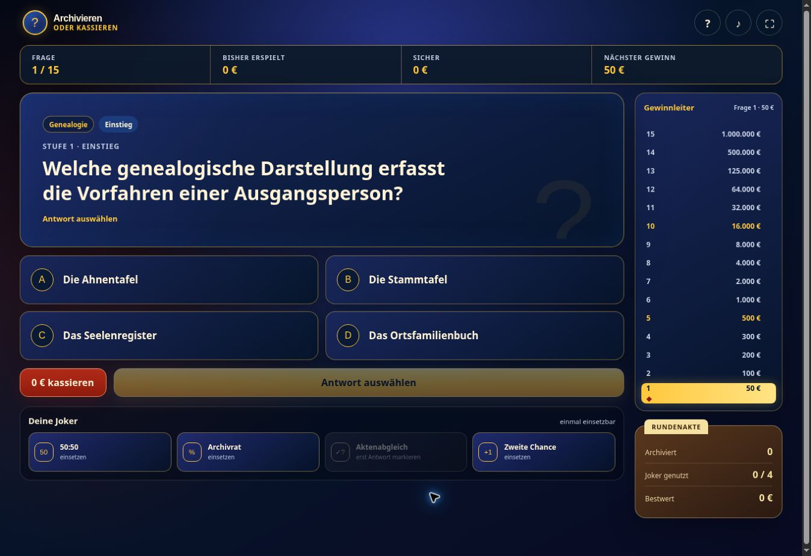
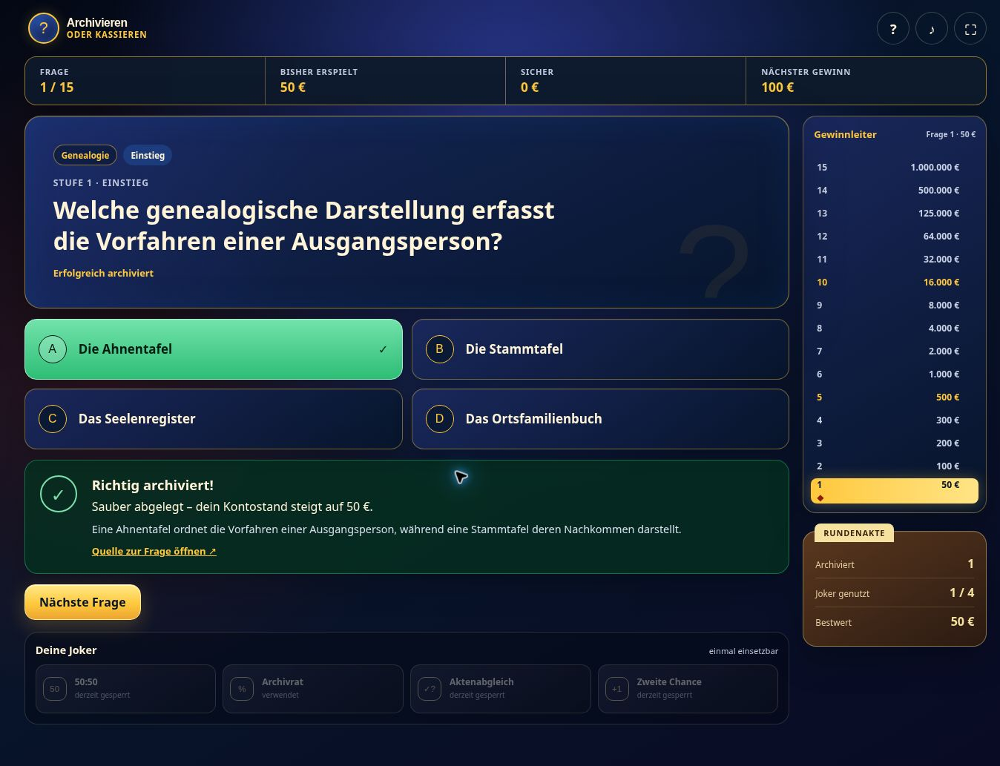

# Archivieren oder Kassieren

> **Experimenteller Prototyp:** Der Quellcode dieses Spiels entstand im Rahmen eines Experiments mit KI-gestützter Softwareentwicklung („Vibecoding“). Das Projekt dient Test-, Unterrichts- und Anschauungszwecken. Die Fragen sind fachlich nur stichprobenartig geprüft; Fehler und unerwartetes Verhalten sind möglich. Alle Gewinne sind rein virtuell.[^code][^blog]

Ein Browserquiz für Archivarinnen und Archivare: 15 Fragen, vier selbst gewählte Joker und eine Gewinnleiter bis zur virtuellen Million. Das Spiel verbindet Fachwissen aus dem Archivbereich mit der Dramaturgie eines Fernsehquizspiels.

**[Spiel online starten](https://sugob05.github.io/archivieren_oder_kassieren.github.io/)** · **[Repository ansehen](https://github.com/sugob05/archivieren_oder_kassieren.github.io)**

## Für wen ist das Spiel gedacht?

Die im ursprünglichen Prompt genannte Zielgruppe sind Archivarinnen und Archivare. Der Katalog enthält **1.000 Fragen in 17 Kategorien**, etwa Archivwesen, Bestandserhaltung, Diplomatik, Heraldik, Paläographie, Retrodigitalisierung und digitale Langzeitarchivierung.[^blog][^code] Für Unterricht und Selbststudium sollten die Antworten Anlass zum Nachlesen und Diskutieren sein.

## Online spielen oder offline starten

Für die Onlineversion genügt der oben verlinkte Spielaufruf. Für eine lokale Kopie:

1. Im [Repository](https://github.com/sugob05/archivieren_oder_kassieren.github.io) unter **Code → Download ZIP** den Quellcode herunterladen.
2. Das ZIP-Archiv entpacken.
3. Die enthaltene **`index.html`** in einem aktuellen Browser öffnen. JavaScript muss aktiviert sein.

Es sind weder Installation noch Build-Schritt, Paketmanager oder lokaler Webserver erforderlich. HTML, CSS, JavaScript, Logo und Fragenkatalog sind in einer Datei eingebettet. Das Spiel selbst benötigt nach dem Download keine Internetverbindung; die freiwillig geöffneten Quellenlinks zu Fragen verweisen auf externe Websites.[^code]

Laufende Runde, Bestwert, Toneinstellung und zuletzt verwendete Fragen werden nach Möglichkeit im `localStorage` des Browsers gespeichert. Ohne verfügbaren Browserspeicher bleibt das Spiel spielbar; die dauerhafte Speicherung ist dann eingeschränkt. Onlineversion und lokal geöffnete Datei teilen sich keinen gemeinsamen Spielstand.[^code]

## Spielablauf

1. **Neue Runde** öffnen und genau vier der sechs Joker auswählen. Jeder ausgewählte Joker ist einmal pro Runde verwendbar.
2. Eine von vier Antworten markieren. Erst der Button **„Antwort … archivieren“** bestätigt die Auswahl verbindlich.
3. Nach einer richtigen Antwort die Erläuterung lesen und zur nächsten Frage wechseln. Die 15 Stufen reichen von „Einstieg“ bis „Absurd schwer“; es gibt kein Zeitlimit.
4. Vor einer verbindlichen Antwort kann die Runde mit **„… kassieren“** beendet werden. Der bis dahin erspielte virtuelle Betrag bleibt erhalten.
5. Eine falsche Antwort beendet normalerweise die Runde. Ohne passenden Schutzjoker bleibt nur die zuletzt erreichte Sicherheitsstufe; vor der ersten Sicherheitsstufe sind es 0 €.[^code]

| Erreichte Stufe | Bedeutung | Virtueller Betrag |
| --- | --- | ---: |
| 5 richtige Antworten | Erste Sicherheitsstufe | 500 € |
| 10 richtige Antworten | Zweite Sicherheitsstufe | 16.000 € |
| 15 richtige Antworten | Höchstgewinn | 1.000.000 € |

Der **Bestwert** bezeichnet den höchsten erreichten Zwischenstand. Er kann höher sein als der Betrag am Ende einer verlorenen Runde.[^code]

### Die sechs Joker

| Joker | Wirkung und Grenzen |
| --- | --- |
| **50:50** | Entfernt falsche Antworten, bis insgesamt zwei ausgeschlossen sind. Eine bereits ausgeschlossene Antwort wird dabei mitgezählt. |
| **Archivrat** | Zeigt eine **simulierte** Abstimmung. Die Verteilung berücksichtigt die Spielstufe und verbleibenden Antworten; eine Mehrheit für die richtige Antwort ist nicht garantiert. Es werden keine realen Personen oder KI-Dienste befragt. |
| **Aktenabgleich** | Prüft die zuvor markierte Antwort anhand der hinterlegten Lösung. Eine richtige Auswahl wird bestätigt, eine falsche ausgeschlossen. Die verbindliche Antwort muss anschließend weiterhin archiviert werden. |
| **Tauschfrage** | Ersetzt die Frage durch eine andere derselben Stufe. Ausgeschlossene Antworten der alten Frage gehen verloren; bereits aktivierter Sicherungsvermerk und Zweite Chance bleiben bestehen. |
| **Zweite Chance** | Muss vor der Antwort aktiviert werden. Nach dem ersten Fehler darf einmal erneut geantwortet werden. Während dieses zweiten Versuchs sind Kassieren und weitere Joker gesperrt. |
| **Sicherungsvermerk** | Schützt bei einer falschen Antwort den bisherigen Gewinn für die aktuelle Frage. Die Runde endet trotzdem. Der Joker ist nur verfügbar, wenn dieser Gewinn über der bestehenden Sicherheitsstufe liegt. |

Die Wirkungen beziehen sich auf die im Quellcode gespeicherte Lösung, deren fachliche Richtigkeit gesondert zu prüfen ist.[^code]

## Bedienung

Neben Maus und Touch sind Tastenkürzel vorgesehen:[^code]

| Taste | Funktion |
| --- | --- |
| `A`–`D` oder `1`–`4` | Antwort markieren |
| `H` | Spielhilfe öffnen |
| `M` | Ton ein- oder ausschalten |
| `L` | Gewinnleiter auf- oder zuklappen |
| `J` | Ersten verfügbaren Joker fokussieren |
| `Tab` / `Umschalt` + `Tab` | Zwischen Bedienelementen wechseln |

**Bekannte Einschränkung:** Die Spielhilfe nennt „Enter archivieren“. Im untersuchten Stand setzt die Antwortauswahl den Fokus jedoch auf den Antwortbutton. Direktes `Enter` wählt diesen erneut aus, statt die Antwort zu bestätigen. Verwende den Archivieren-Button per Klick oder wechsle mit `Tab` zu diesem Button und drücke dort `Enter`.[^review]

Hilfe, Ton und – sofern der Browser es unterstützt – Vollbild sind auch über die obere Leiste erreichbar. Das Layout passt sich kleineren Bildschirmen an. Fokusmarkierungen, ARIA-Beschriftungen und Rücksicht auf reduzierte Animationen sind vorhanden; daraus folgt keine abgeschlossene Prüfung der Barrierefreiheit.[^code]

## Entstehung: ein Vibecoding-Experiment

Das Projekt begleitet den bereitgestellten, unveröffentlichten Blogartikelentwurf **„Erfahrungen mit Vibecoding – Apps fürs Archiv jetzt selbst programmieren lassen“**. Er untersucht, wie weit eine natürlichsprachige Aufgabenbeschreibung trägt. Das Archivquiz dient als überschaubares Anschauungsbeispiel mit begrenztem Funktionsumfang, ohne tiefe Systemintegration und direkt im Browser nutzbar.[^blog]

Laut Entwurf wurden zunächst Fragen und ein Logo generiert. Die Fragen lagen für die Entwicklung als XLSX vor. Im hier dokumentierten Repository sind diese Ausgangsdateien nicht separat enthalten; Fragen und Logo stecken in der `index.html`.[^blog][^code]

Ein Auszug aus dem im Entwurf wiedergegebenen Prompt:

> „Tu bitte so, als wärst du ein professioneller Game Designer. Plane ein Spiel, welches komplett mit JavaScript und HTML auskommt und „Archivieren oder Kassieren“ heißen soll und sofort offline heruntergeladen und im Browser gestartet werden kann.“

Weitere Anforderungen waren vier aus sechs Jokern, 15 Schwierigkeitsstufen, Sicherheitsstufen, Fragenkatalog und Logo, eine Hilfe, Soundeffekte und ein Hinweis auf den Testcharakter ohne echte Gewinne.[^blog]

Laut Entwurf lag nach **32 Minuten und 23 Sekunden** ein Prototyp vor: eine Selbstauskunft zur Entstehung, keine hier nachgemessene Entwicklungszeit und kein Qualitätsnachweis. Der Disclaimer nennt **Tony Franzky** als Initiator des Experiments und bezeichnet das verwendete Modell als **„GPT-5.6. Sol Ultra“**; diese Angaben werden aus dem Disclaimer übernommen.[^blog][^code]

## Kurze Codesynopse

Die etwa **4,7 MB große `index.html`** bündelt die gesamte Anwendung. Das eingebettete PNG-Logo trägt wesentlich zur Dateigröße bei. Es gibt kein Framework, Backend oder nachzuladendes JavaScript-Paket.[^code]

| Bestandteil | Aufgabe |
| --- | --- |
| HTML und CSS | Startseite, Jokerauswahl, Spielrunde, Ergebnisansicht und Dialoge; responsives Layout und Animationen |
| JSON-Block `questionData` | Vollständiger Fragenkatalog mit Lösungen, Erläuterungen und Quellenadressen |
| JavaScript | Initialisierung, zentraler Spielzustand, Fragenwahl, Joker, Antwortprüfung und Darstellung |
| Browser-APIs | `localStorage` für Speicherung, Web Audio API für synthetische Sounds und Fullscreen API für Vollbild |

Ein zentrales `state`-Objekt verwaltet Stufe, Gewinn, Sicherheitsbetrag, Frage, Auswahl und Joker. Funktionen wie `loadQuestion()`, `resolveAnswer()` und `finishRound()` steuern den Ablauf. Die Fragenwahl bevorzugt unverwendete Fragen und einen Kategoriewechsel, soweit passende Einträge vorhanden sind. Die Antwortreihenfolge wird für jede geladene Frage neu gemischt.[^code]

Die Ein-Datei-Struktur erleichtert Download und Offlinebetrieb. Für größere Erweiterungen erschwert sie jedoch die getrennte Pflege von Oberfläche, Logik, Daten und Bildmaterial.

### Fragen bearbeiten

Die Datensätze stehen im JSON-Skriptblock mit der ID `questionData`:[^code]

| Feld | Inhalt |
| --- | --- |
| `id`, `category` | Eindeutige Fragekennung und Kategorie |
| `level`, `difficulty` | Stufe 1–15 und lesbare Schwierigkeitsbezeichnung |
| `prompt`, `options` | Fragetext und genau vier Antworttexte |
| `correct` | Index der richtigen Antwort: `0` bis `3` |
| `explanation`, `source` | Erläuterung und Quellenadresse |

Antworttexte und Lösungsindex müssen zusammenpassen. Die Stufen 1–5 enthalten jeweils 70 Fragen, die Stufen 6–15 jeweils 65; diese Zuordnung belegt keine empirisch geprüfte Schwierigkeit.[^code]

## Bekannte Grenzen und Beiträge

Die strukturelle Durchsicht fand 1.000 Datensätze ohne doppelte IDs oder identische Fragetexte. Das bestätigt die Datenform, **nicht die fachliche Richtigkeit**. Der Blogentwurf beschreibt ausdrücklich nur eine stichprobenartige fachliche Prüfung. Die Anzeige „1.000 geprüfte Fragen“ auf der Startseite sollte deshalb nicht als vollständige fachliche Freigabe verstanden werden.[^review][^blog]

Ein messbarer Hinweis auf die nötige Überarbeitung: Bei **619 von 1.000 Fragen (61,9 %)** ist die als richtig markierte Antwort nach Zeichenlänge eindeutig die längste der vier Optionen. Das vom Entwurf angesprochene Muster kann Raten erleichtern und bleibt trotz gemischter Antwortpositionen bestehen.[^review]

Hilfreiche Beiträge sind insbesondere:

- **Fachliche Korrekturen:** Frage-ID, betroffene Formulierung, Änderungsvorschlag und belastbare Quelle angeben.
- **Ausgewogenere Antworten:** Distraktoren und richtige Antwort hinsichtlich Länge, Präzision und Plausibilität prüfen.
- **Bedienungsfehler:** Reproduktionsschritte, Browser, Gerät und erwartetes Verhalten beschreiben.

Weiterentwicklungen sollten in kleinen, nachvollziehbaren Änderungen erfolgen und die betroffenen Spielregeln überprüfen.

## Screenshots

Die Aufnahmen zeigen verschiedene Ansichten desselben normalen Spieldurchlaufs vom **7. Oktober 2026**. Sie sind unveränderte Browseraufnahmen; konkrete Fragen und Antwortpositionen können in anderen Runden abweichen.

| Ansicht | Datei |
| --- | --- |
| Startseite | [01-startseite.jpg](docs/screenshots/01-startseite.jpg) |
| Spielhilfe | [02-spielhilfe.jpg](docs/screenshots/02-spielhilfe.jpg) |
| Auswahl der vier Joker | [03-jokerauswahl.jpg](docs/screenshots/03-jokerauswahl.jpg) |
| Laufende Spielrunde | [04-spielrunde.jpg](docs/screenshots/04-spielrunde.jpg) |
| Simulierte Abstimmung des Archivrates | [05-archivrat.jpg](docs/screenshots/05-archivrat.jpg) |
| Antwortauswertung | [06-antwortauswertung.jpg](docs/screenshots/06-antwortauswertung.jpg) |
| Rundenabschluss | [07-rundenabschluss.jpg](docs/screenshots/07-rundenabschluss.jpg) |
| Nutzungs- und Experimenthinweise | [08-disclaimer.jpg](docs/screenshots/08-disclaimer.jpg) |

## Repository und Lizenzstatus

Im untersuchten Ausgangsstand enthält das Repository ausschließlich `index.html`. Diese README und `docs/screenshots/` sind ergänzende Dokumentation. Eine separate `LICENSE`-Datei ist in diesem Stand nicht vorhanden. Diese README vergibt keine zusätzliche Lizenz für Code, Fragen oder Bildmaterial.[^code]

### Dokumentationsgrundlage

[^code]: Untersucht am 07.10.2026: [`index.html`, Commit `b7485fe`](https://github.com/sugob05/archivieren_oder_kassieren.github.io/blob/b7485fe4c75db86f8380d36c14293cf061c3740d/index.html) und [Dateibaum dieses Stands](https://github.com/sugob05/archivieren_oder_kassieren.github.io/tree/b7485fe4c75db86f8380d36c14293cf061c3740d). Der Spielquellcode wurde für diese Dokumentation nicht verändert.
[^blog]: Vom Projekt bereitgestellter, unveröffentlichter Entwurf „Erfahrungen mit Vibecoding – Apps fürs Archiv jetzt selbst programmieren lassen“, Datei `Vibecoding.txt`. Angaben zum Entwicklungsprozess und die Promptauszüge stammen aus diesem Entwurf; die Datei wird nicht als Bestandteil des Repositorys vorausgesetzt.
[^review]: Befunde der Quellcodedurchsicht und Browserprüfung am 07.10.2026 für den oben verlinkten Stand. Die Zahl 619 zählt Datensätze, in denen der über `correct` markierte Antworttext nach Zeichenlänge strikt länger als jede der drei anderen Optionen ist; Gleichstände zählen nicht mit. Dies ist eine strukturelle Auswertung und keine vollständige fachliche Kuratierung.
